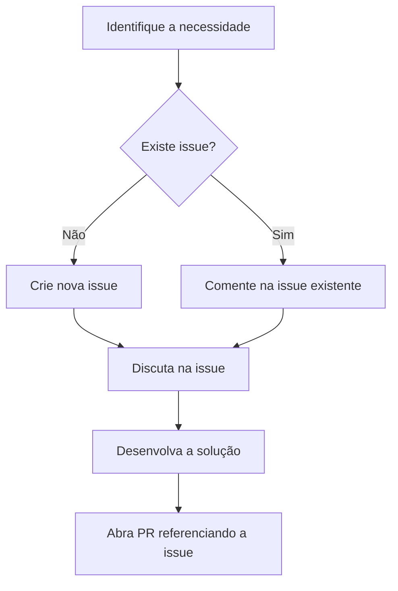

# Workflow de Desenvolvimento - Issue-PR Linking

Este documento descreve o workflow obrigatório para contribuições no repositório granatonatalia.github.io.

## 🎯 Objetivo

Estabelecer um processo claro e organizado onde **toda mudança de código deve estar relacionada a uma issue específica**, garantindo:
- Documentação clara do histórico de desenvolvimento
- Discussão prévia sobre mudanças propostas
- Rastreabilidade de funcionalidades e correções
- Melhor organização do projeto

## 📋 Regra Principal

**⚠️ TODO PULL REQUEST DEVE ESTAR RELACIONADO A UMA ISSUE EXISTENTE**

### Por que esta regra é importante?

1. **Documentação**: Issues fornecem contexto sobre o que está sendo desenvolvido
2. **Discussão**: Permite discussão sobre a implementação antes do desenvolvimento
3. **Rastreabilidade**: Facilita o acompanhamento de funcionalidades ao longo do tempo
4. **Organização**: Mantém o projeto organizado e com histórico claro
5. **Colaboração**: Outros podem entender o propósito das mudanças

## 🔄 Fluxo de Trabalho

### 1. Antes de começar qualquer desenvolvimento



### 2. Criando uma Issue

Use o template de issue disponível e inclua:
- Descrição clara do problema ou funcionalidade
- Contexto necessário
- Critérios de aceitação (se aplicável)
- Screenshots ou exemplos (se relevante)

### 3. Desenvolvendo a solução

1. **Fork** o repositório
2. **Crie uma branch** descritiva: `feature/issue-X-nome-funcionalidade`
3. **Desenvolva** seguindo as diretrizes de código
4. **Teste** localmente

### 4. Abrindo o Pull Request

No PR, use uma das seguintes palavras-chave para linkar automaticamente à issue:
- `Fixes #123`
- `Closes #123`
- `Resolves #123`

Exemplo de descrição de PR:
```markdown
## Descrição
Implementa controle de tamanho de fonte para melhorar acessibilidade.

## Issue Relacionada
Fixes #15

## Mudanças
- Adiciona botões A- e A+ no header
- Implementa 4 tamanhos de fonte (14px, 16px, 18px, 20px)
- Persiste preferência no localStorage
```

## 🚫 O que NÃO fazer

- ❌ Abrir PR sem issue relacionada
- ❌ Fazer mudanças sem discussão prévia (para mudanças significativas)
- ❌ Usar títulos vagos nas issues ou PRs
- ❌ Ignorar o template de PR

## ✅ Boas Práticas

- ✅ Crie issues descritivas e detalhadas
- ✅ Discuta a implementação antes de começar
- ✅ Use títulos claros e específicos
- ✅ Referencie sempre a issue no PR
- ✅ Mantenha PRs focados e concisos
- ✅ Teste suas mudanças antes de abrir o PR

## 📝 Exemplos de Issues Válidas

### Bug Report
```
Título: Modo escuro não persiste após reload da página
Descrição: Quando o usuário ativa o modo escuro e recarrega a página, ela volta para o modo claro.
Comportamento esperado: O modo escuro deve ser mantido após reload.
```

### Feature Request
```
Título: Adicionar seção de certificações ao portfolio
Descrição: Criar nova seção para mostrar certificações profissionais com data e instituição.
```

### Maintenance
```
Título: Otimizar carregamento de fontes
Descrição: Implementar preload de fontes para melhorar performance da página.
```

## 🆘 Exceções

As únicas exceções à regra são:
- Correções de typos muito pequenos
- Ajustes de configuração menores (.gitignore, etc.)
- Atualizações de documentação menor

**Mesmo assim, é recomendado criar uma issue para manter o histórico.**

## 📊 Benefícios do Workflow

1. **Histórico claro** de todas as mudanças
2. **Melhor colaboração** entre contribuidores  
3. **Documentação automática** do desenvolvimento
4. **Facilita code review** com contexto claro
5. **Ajuda no planejamento** de futuras versões

---

**Lembre-se**: Este workflow existe para melhorar a qualidade e organização do projeto. Quando seguido corretamente, beneficia todos os envolvidos no desenvolvimento.